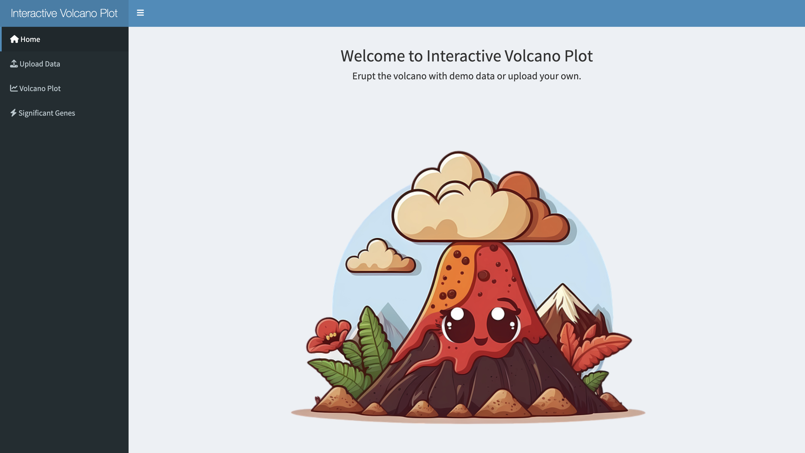
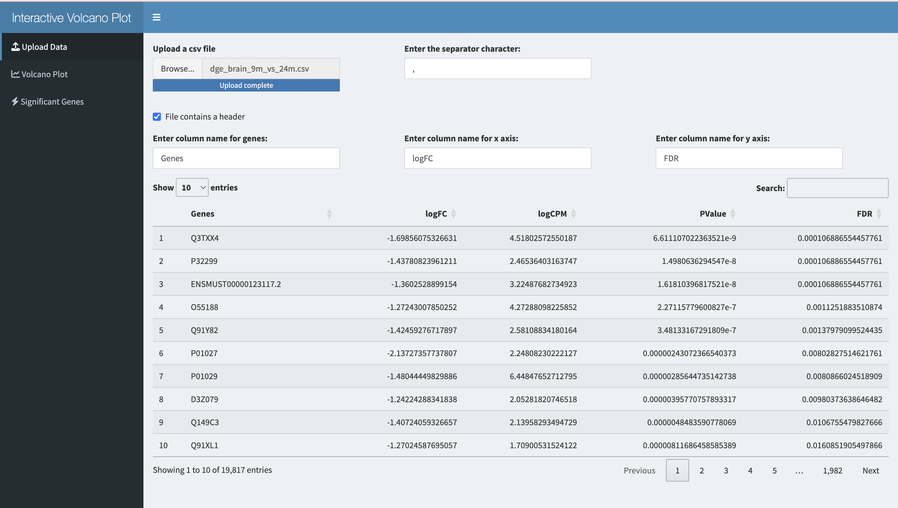
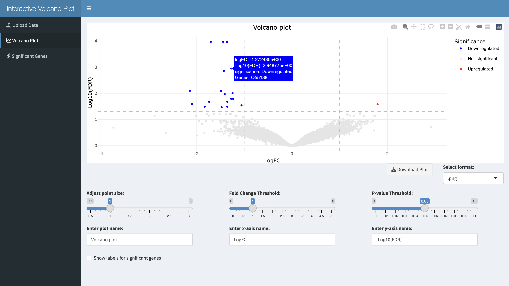

# Interactive Volcano Plot

* An R shiny web application for interactive volcano plot to visualize pre-processed bioinformatics data.

* The data used for this application is processed with edgeR or DESeq2. More details can be found in [here]( https://github.com/uyennguyen30696/BME237).

### Demo

[Youtube video](https://youtu.be/k3WvXQ2nNAM)

### Screenshots

### Reference
Srivastava A, Barth E, Ermolaeva MA, Guenther M, Frahm C, Marz M, Witte OW. Tissue-specific Gene Expression Changes Are Associated with Aging in Mice. Genomics Proteomics Bioinformatics. 2020 Aug;18(4):430-442. doi: 10.1016/j.gpb.2020.12.001. Epub 2020 Dec 11. PMID: 33309863; PMCID: PMC8242333.
